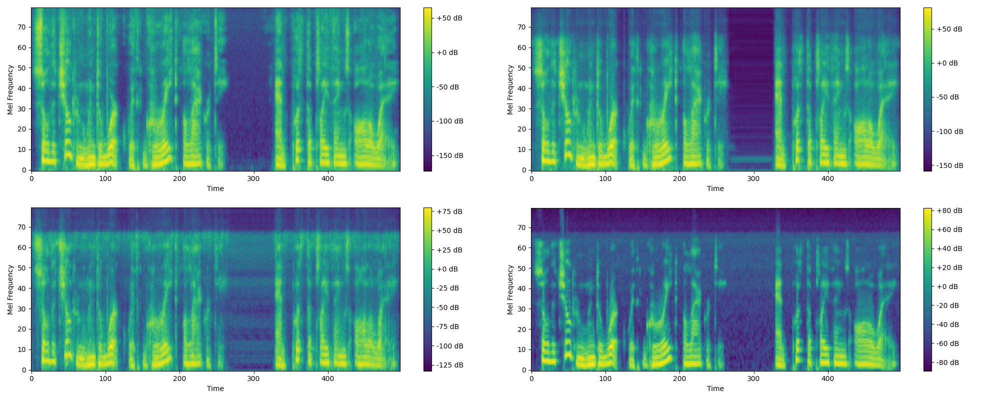

# 🎧 Audio Super Resolution via Latent Consistency Models
**Distilling Diffusion Models for One-Step Inference in Tokenised Latent Space**

> This project explores one-step **Latent Consistency Models (LCMs)** for **Audio Super Resolution (ASR)** — reconstructing high-fidelity 24 kHz audio from degraded 12 kHz inputs.
> By distilling a Multi-Band Diffusion (MBD) teacher into a single-step transformer operating in EnCodec’s tokenised latent space, this approach achieves a **557× speed-up** while maintaining perceptual quality.

---

## 📖 Abstract

Diffusion-based models achieve impressive results in Audio Super Resolution but are computationally expensive due to iterative denoising.
This research investigates **one-step latent consistency distillation**, where a pretrained diffusion model is distilled into a **transformer** operating in **tokenised latent space**.
The model achieves real-time inference, maintaining perceptual quality comparable to the diffusion teacher.

**Key Results:**
- ⚡ **557× faster inference**
- 🎚 **+11.74 dB improvement in SI-SDR**
- 🔊 **0.894 STOI (vs 0.921 teacher)**

---

## 🧠 Model Overview

The proposed **LCM-MCB (Latent Consistency Model with Multi-Codebook Blocks)** operates directly on EnCodec’s discrete latent tokens instead of raw waveforms.

  

### 🔹 Workflow
1. **Input:** 12 kHz degraded audio
2. **Tokenisation:** Using pretrained EnCodec
3. **Teacher:** Multi-Band Diffusion (MBD) generates 24 kHz targets
4. **Distillation:** Transformer learns one-step mapping via consistency loss
5. **Output:** Reconstructed 24 kHz waveform through EnCodec Decoder

---

## ⚙️ Experimental Setup

- **Dataset:** LibriTTS (train-clean-100 subset, 33k clips)
- **Sampling rates:** 12 kHz → 24 kHz
- **Hardware:** 2× NVIDIA Quadro RTX 8000 (48GB each)
- **Training:** 32 epochs, batch size 2
- **Optimizer:** AdamW (lr = 2×10⁻⁴)

  

---

## 📊 Results

| Metric | Teacher (MBD) | LCM (Student) | Improvement |
|--------:|---------------|---------------|-------------:|
| **Avg. Inference Time (s)** | 61.837 | 0.111 | ×557 faster |
| **Batch Inference Time (s)** | 33.224 | 0.0666 | ×499 faster |
| **SI-SDR (dB)** | –8.47 | **3.27** | +11.74 |
| **STOI** | **0.921** | 0.894 | −0.027 |

---

### 🎛 SI-SDR and STOI Trends

  

  

---

### 🎵 Spectrogram Comparison

  

- **Top-left:** Ground Truth (24 kHz)
- **Top-right:** Degraded Input (12 kHz)
- **Bottom-left:** LCM Reconstruction
- **Bottom-right:** Diffusion Teacher

The LCM reconstruction preserves harmonic and temporal structure while eliminating stochastic noise typical of diffusion-based synthesis.

---

## 🚀 Key Contributions

✅ Introduced **one-step LCM** for audio super resolution
✅ Achieved **real-time inference** via transformer distillation
✅ Demonstrated **high perceptual quality** with efficient computation
✅ Established groundwork for **real-time audio enhancement systems**

---

## 🧩 Future Work

- Integrate hybrid latent–waveform refinement
- Explore partial differentiability for improved spectral fidelity
- Extend to multi-speaker and noisy datasets
- Develop lightweight deployment versions for streaming applications

---

## 🧾 Citation

If you use this work, please cite:

@misc{nailana2025asr_lcm,
author = {Oratile Nailana},
title = {Audio Super Resolution via Latent Consistency Models: Distilling Diffusion Models for One-Step Inference in Tokenised Latent Space},
year = {2025},
institution = {University of the Witwatersrand},
url = {https://github.com/retr0-spection/ASR-LCM-Research}
}

---

## 🙏 Acknowledgements

This work was conducted under the supervision of **Dr. Richard Klein**
and made possible through the **High Performance Computing (HPC)** resources
of the **University of the Witwatersrand**.

---

## 🧠 Author

**Oratile Nailana**
Computer Science and Applied Mathematics
University of the Witwatersrand
📧 2327853@students.wits.ac.za

---
